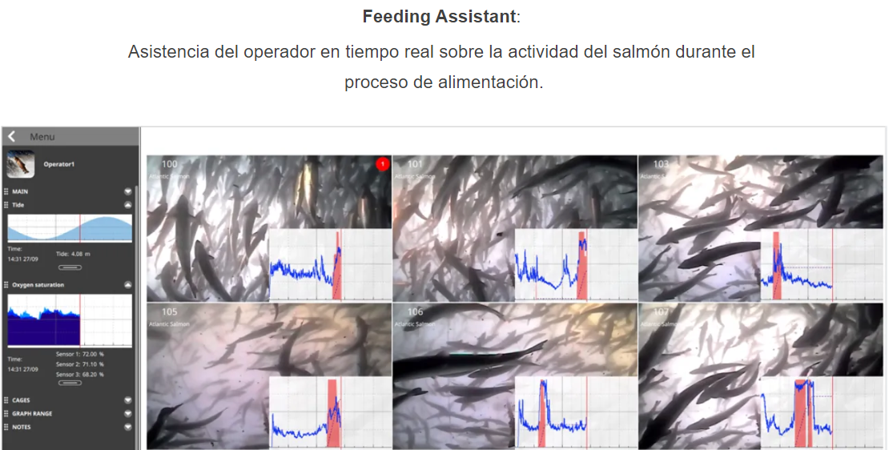

```{r setup, include=FALSE, comment=TRUE}
knitr::opts_chunk$set(echo = FALSE)
library(knitr)
library(kableExtra)
library(ggplot2)
library(dplyr)
library(readxl)
library(datasets)
library(ggplot2)
library(readxl)
library(tidyr)
library(dplyr)
library(graphics)
library(stats)
library(stringr)
library(gridExtra)
library(knitr)
library(summarytools)
library(stats)
library(psych)
library(pander)
library(car)
library(lmtest)
library(lme4)
library(readxl)
library(ggplot2)
library(dplyr)
library(psych)
library(car)
library(nlme)
library(lme4)
library(readr)
library(lmtest)
library(sjPlot)
library(multcomp)
library(kableExtra)


```

## **Introducción**
El software en uso a través de IA (**3Se**)[^1] establece la mayor o menor disposición de los peces a alimentarse durante el período de cultivo medido a través de un % de actividad. Alimentar a los salmones durante el ciclo productivo cuando la actividad medida es menor a 20%, probablemente produciría pérdida de alimento generando una mayor conversión y un menor crecimiento. De este modo, se han recopilado los datos referentes a la cantidad de alimento ofertada en la fase de 20% de actividad durante todo el período productivo y los parámetros productivos de conversión (**FCRc**)[^2] y de crecimiento (**SGRc**)[^3] para verificar la incidencia de este parámetro en los resultados productivos.

[^1]:https://3se.cl/
[^2]:https://www.salmonexpert.cl/article/fcr-un-indicador-de-eficiencia-y-productividad-en-science-week/
[^3]:https://www.engormix.com/balanceados/articulos/elementos-claves-control-gestion-t30439.htm

## **Objetivo**

El objetivo de este estudio es definir si es que la oferta de alimento entregada bajo esta fase de 20% de actividad afecta el desempeño productivo. Para objeto de este análisis, se eligió como variable respuesta el factor de conversión (FCR)

## **Software Feeding Assistant de 3Se**

El software permite a través de análisis de imagen definir la disposición de los peces a alimentarse medidas en fases. En fase de 20% de actividad habría posibilidad de pérdida de alimento afectando el FCR. Un mayor FCR representa un peor resultado, es decir una mayor conversión de alimento.

```{r, echo=FALSE, out.width = '90%', fig.align='center',fig.cap= "Imagen 20 actividad"}



```

## **Base de Datos**

Se recopilaron 273 observaciones de 16 centros de cultivos que iniciaron su producción en 2020, 2021 y 2022, registrando el consumo bajo 20% de actividad, el FCRc y SGRc al final del ciclo. En la tabla se muestran las columnas de la Base de Datos.

```{r echo=FALSE, out.width = '50%', fig.align='center'}

BDatos <-read_excel("Base_Datos_Cons_FCR_SGR.xlsx")
BDatos_mod <- BDatos %>% 
  mutate(Consumo_20=`Consumo_ bajo_ 20`*100, FCRc_porc=FCRc*100, SGRc_porc=SGRc*100) %>%  
  dplyr::select(c(Year_class, Centro,Jaula, Consumo_20, FCRc_porc, SGRc_porc))
BDatos_mod_f <- BDatos_mod[-c(81, 106,107),]
head(BDatos_mod_f[c("Year_class","Centro","Consumo_20", "FCRc_porc", "SGRc_porc")]) %>% knitr:: kable(align= c( "c", "c", "c", "c","c"), caption = "Base de datos: Variables de estudio seleccionadas") %>% kable_styling(font_size = 10, position = "left", full_width = FALSE)

```
## **Hipótesis de Prueba**


Para comprobar si el consumo de alimento bajo la fase de actividad del 20% afecta el rendimiento productivo, en este caso se eligió contrastar a través de análisis estadístico, el consumo en esta fase con la variable de conversión de alimento, ya que por su naturaleza es la variable respuesta que se relaciona de mejor manera con la variable consumo. De este modo, las hipótesis nula y alternativa a contrastar serían:

 **H~0~:** El consumo de alimento bajo 20% de actividad **_no afecta el FCR._**

 **H~1~:** El consumo de alimento bajo 20% de actividad  **_afecta el FCR._**


## **Resumen de métodos estadísticos**

- Se verifica la correlación entre la variable respuesta FCR y Consumo bajo 20% de actividad mediante test de Pearson.
- Se establece un modelo lineal de la variable FCR en función de Consumo bajo 20% de actividad, Centro y Año de cultivo
- Se aplican test para evaluación de supuestos de independencia, homogeneidad de varianzas y normalidad.
- Se aplica un análisis de varianza de 3 factores para determinar si los efectos de los factores son o no significativos en la variable respuesta.
- Se determina nivel de significancia del modelo y capacidad predictora


## **Análisis de Varianza de 3 factores**

Los valores de F encontrados indican que tanto las variables consumo bajo 20% de actividad y Centro afectan a la variable respuesta. Asimismo, esto no ocurre con la variable Year class.

```{r}
Lineal2 <- lm(FCRc_porc ~ Consumo_20 + Centro + Year_class, data = BDatos_mod_f)
anova <- anova(Lineal2)
kbl(anova, align='cccccc',
linesep=c("","","","","",""), digits = 3,
caption = "ANOVA de tres factores sobre la variable FCRc")

```
 
## **Conclusión**

De acuerdo a los análisis estadísticos realizados, se rechaza la hipótesis nula y se concluye que el consumo de alimento bajo 20% de actividad, pero también la variable centro afectan el factor de conversión de los peces (FCR).

